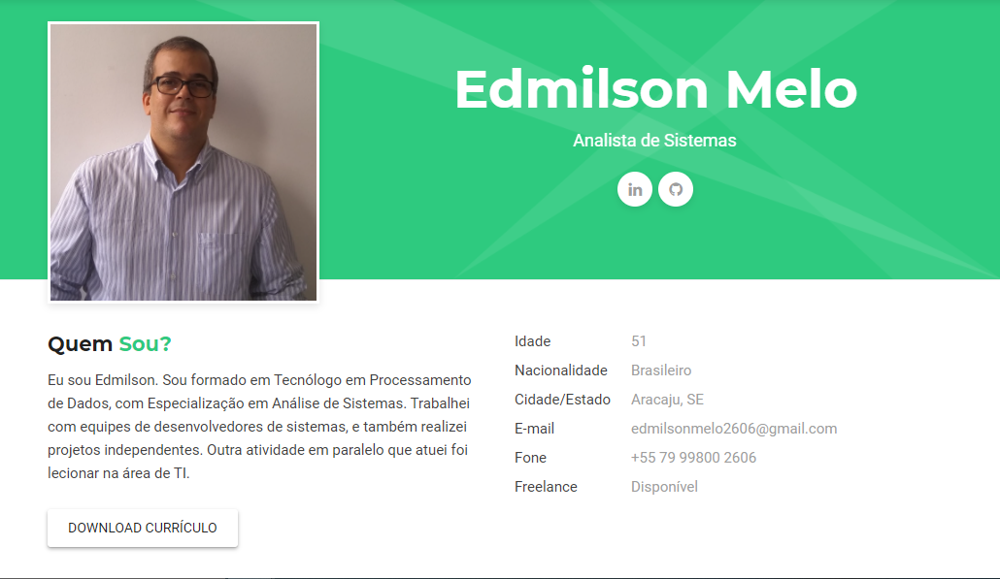

# Currículo Online
> Currículo online desenvolvido no curso de *Git e Github* da **Geek University**.

Este projeto é uma página html estática, que foi desenvolvida no curso de Git e Github da Geek University.  Utilizando das ferramentas estudadas no curso criamos o nosso projeto *Currículo Online*




## Clone

```sh
https://github.com/Edmilson2606/Edmilson2606.github.io.git
```

## Contato

Edmilson Melo
[email]() - <edmilsonmelo2606@gmail.com>

###### Distribuição open source ######
